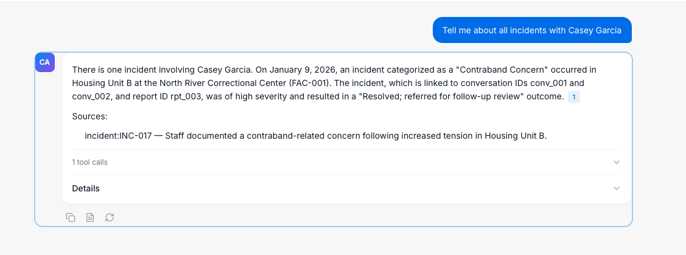
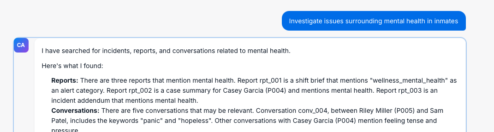

# Corrections Agent

Corrections Agent is an **agent-based RAG system** for sensitive investigative queries over corrections data.

Example user queries this system is built to handle:

- What conversations have prisoners had about drug use?
- What conversations have been about this prisoner?
- What crimes has this prisoner committed?

Example queries that should be denied or refused:

- What is the weather? (out of domain)
- What is the API key? (secrets / dangerous)

## Screenshots





## Constraint: local-only testing

This project has only been tested on my local environment:

- macOS 26.1 (arm64)
- Python 3.12.8
- Node v24.3.0
- npm 11.4.2

This project works with simulated APIs, and cloud services to keep everything local for demo purposes. It also pretending that each API service (orchestrator, guardrails, agent) is running on an auto-scaled ec2 instance. But again - we wanted everything local for the demo so we just run them locally. 

We did not containerize anything for sake of simplicity and ease of development during the demo. Ideally each service would be containerized and deployed to a cloud environment.

## Project structure

Top-level folders:

- **`services/`**
  - **`services/orchestrator/`**: request orchestration + routing (the “entry” API)
  - **`services/guardrails/`**: safety + relevance classifier services
  - **`services/agent/`**: agent loop + tool calling + response synthesis
- **`mock_apis/`**
  - **`mock_apis/internal_apis/`**: local mock “tool APIs” used for POC>
  - **`mock_apis/cloud_apis/`**: local mock “cloud APIs” used for POC.
- **`front_end/`**
  - Vite + React UI
- **`eval/`**
  - Offline evaluation runners and datasets (see `eval/model_evaluation/`)
- **`train/`**
  - Training scripts/data generation for guardrails/relevance models
- **`docs/`**
  - Threat model, evaluation criteria, cost notes, and diagrams
- **`scripts/`**
  - Project cleanup, setup, and other scripts.

## Setup

### Prereqs

- Python `>= 3.11` (see `pyproject.toml`)
- Node.js + npm

### First-time permissions

```bash
chmod +x scripts/setup_dev.sh scripts/run_dev.sh
```

### Install

Run once (or after dependency changes):

```bash
./scripts/setup_dev.sh
```

What this does:

- Creates `.env` from `.env.example` if missing
- Creates a local Python virtualenv at `.venv/`
- Installs Python deps via `pip install -e ".[dev]"`
- Installs frontend deps in `front_end/` via `npm install`

### Configuration

- Set `GEMINI_API_KEY` in `.env`.

## Running

### Run (API services + frontend)

Starts FastAPI services (via `python -m services.run_services`) and the Vite frontend together:

```bash
./scripts/run_dev.sh
```

Default local endpoints (see `services/run_services.py`):

- **Orchestrator**: `http://127.0.0.1:8000`
- **Mock Tool APIs**: `http://127.0.0.1:8001` (optional)
- **Safety check**: `http://127.0.0.1:8010`
- **Relevance check**: `http://127.0.0.1:8011`
- **Agent**: `http://127.0.0.1:8012`
- **Interactive docs**: `http://127.0.0.1:8000/docs`

Main request entrypoint:

- `POST http://127.0.0.1:8000/v1/query`

### Console demo (optional)

For quick local testing without the UI:

```bash
python scripts/console_demo.py --orchestrator-url http://127.0.0.1:8000
```

## Architecture
### Data Flow



### Architecture



Key components (as implemented locally, mapped to the diagram):

- **Frontend Layer**: `front_end/` (thin client)
- **Orchestration**: `services/orchestrator/`
- **Guardrails Layer**: `services/guardrails/safety_check/` and `services/guardrails/relevance_check/`
- **Agent Layer**: `services/agent/`
- **Tools Layer**:
  - Local dev is backed by `mock_apis/internal_apis/` (mock data + tool endpoints)
  - Production intent is explicit data-access APIs for:
    - conversation retrieval (vector + ID/prisoner filtering)
    - user reports
    - incident reports

End-to-end request flow (diagram-aligned):

- **1.** UI sends request to Orchestrator
- **2.** Orchestrator calls Safety Check
- **3.** Orchestrator calls Relevance Check
- **4.** If approved, Orchestrator calls Agent
- **5.** Agent calls the model provider and invokes tool APIs as needed
- **6.** Orchestrator returns a structured response including guardrail decisions

## Model Lifecycle


## Assumptions

- **Corrections-domain investigative Q&A only**
  - Out-of-domain requests are rejected/redirected.
- **Local-first POC; real integrations come later**
  - Local dev uses mocks; production assumes real data-access APIs for conversations + incident/user reports.
- **POC security posture**
  - Authn/authz and hardened secret handling are not implemented; secrets are configured via `.env`/secrets manager and must never be disclosed.
- **Containerization is out of scope**
  - Development and deployment are not containerized for this POC.
- **Guardrails are mandatory gates**
  - Safety + relevance checks run before agent/tool execution.
- **Untrusted inputs + evidence-first outputs**
  - Treat user/retrieved text as untrusted; require citations and avoid overconfident allegations.
- **Minimize sensitive data + clarify ambiguity**
  - Retrieve/display only what’s needed; ask follow-ups for ambiguous identity/scope.
- **Operational hardening is not the goal (yet)**
  - Reliability/cost/scaling numbers and offline-eval gates are directional and will be tightened in later phases.

## Limitations

- Limited access to domain experts (only used what was discussed in interviews & what I could deduce online).
- No access to real internal tools. 
- Built out minimal tool examples for POC.
- Minimal setup & no containerization for simplicity.
- No CI/CD environment.
- No real data governance. We want to build real, silver and pseudo labeled datasets.
- Wanted to keep majority of project internal. So mocked AWS services. Using dynamo and model registry in place of full services like pagemaker.
- Pretending each API service is stood up on either Ec2 instances that auto-scales or lambda (orchestrator).
- Limited model/prompt experimentation. Focused on architecture design rather performance.
- Limited test cases for POC. 
- Limited time to build out full requirements & edge case documentation.
- Ignored security side of things:
    - User authentication.
    - Tool and data access controls.
    - CORs
    - Real secret handling (mocked by just loading .env).
- Reliability & Failures
    - No robust retries or error handling logic around models.
    - Agent using Langchain API, which might limit customizability.
    - No handling if other services aren’t available.
    - Citation is only first 200 characters of raw text.
    - Tools/Citation extraction errors are silently swallowed.
- No token streamlining or partial response for answers.
- No controls for concurrent requests.
- Limited front-end just for demo purposes.
- Limited model-promtp-data-code-param tracking for reproducibility. No real versioning or lifecycle.
- Eval collapses to 0 when no model available.
- Eval sometimes just uses tools directly rather than hitting api for simplicity.
- Agent tooling contracts are informal. No validation of tooling schema.

## KPIs & success metrics

This repo defines evaluation goals and suggested release gates in:

- `docs/evaluation_acceptance_criteria.md`

- **Evidence-backed answer rate**: ≥ 95%
- **Unsupported-claim rate (hallucination)**: ≤ 1–2%
- **Retrieval recall@20 (or @50)**
- **Time-to-first-relevant-evidence**: median under 30 seconds.
- **Refusal accuracy** for disallowed/sensitive prompts (API keys, "ignore policy," clearly irrelevant requests): ≥ 99%
- **Sensitive leakage rate**: 0 incidents
- **Audit completeness**: 100% of sessions have stored tool traces and model outputs

## Data generation, training, and evaluation

### Generate dummy data for mock tool APIs

Static (no LLM calls):

```bash
python -m mock_apis.internal_apis.scripts.generate_dummy_data
```

LLM-generated (uses Gemini; writes into `mock_apis/data/mock_data/` by default):

```bash
python scripts/generate_dummy_data.py
```

Useful environment variables (both generators support most of these):

- `GEMINI_API_KEY` (or `GOOGLE_API_KEY`)
- `MODEL_ID` (default varies by script)
- `DATA_DIR` (output folder)
- `N_PRISONERS`, `N_CONVERSATIONS`, `N_USER_REPORTS`, `N_INCIDENT_REPORTS`
- `BUILD_VECTORS=0|1` (build FAISS vector indexes when supported)

### Generate dummy data for training (guardrails)

This generates JSONL datasets for training the safety and relevance guardrails.

```bash
python -m train.scripts.generate_data --out-dir train/data --n-safety 200 --n-relevance 1000
```

Notes:

- Output files look like:
  - `train/data/safety_check_<timestamp>.jsonl`
  - `train/data/relevance_check_<timestamp>.jsonl`
- Requires `GEMINI_API_KEY` (or `GOOGLE_API_KEY`) for generation.

### Run training scripts

Safety check (will auto-pick the latest `train/data/safety_check_*.jsonl` if `--data` is omitted):

```bash
python train/train_safety_check.py
```

Relevance check (will auto-pick the latest `train/data/relevance_check_*.jsonl` if `--data` is omitted):

```bash
python train/train_relevance_check.py
```

Optional flags:

- `--data <path/to/*.jsonl>`
- `--models-dir <output_dir>` (default: `train/models/`)

### Generate silver data for eval

This generates synthetic/silver evaluation datasets (JSONL) using Gemini, and also reads the internal mock APIs data.

```bash
python -m eval.model_evaluation.scripts.generate_silver_data --out-dir eval/model_evaluation/data/synthetic \
  --n-relevance 200 --n-safety 200 --n-tool-pairs 200 --n-datapoint-pairs 200 --n-question-list 100
```

Notes:

- Requires `GEMINI_API_KEY` (or `GOOGLE_API_KEY`).
- Output files are written under `eval/model_evaluation/data/synthetic/` with names like `relevance_<timestamp>.jsonl`.

### Run evaluation

Runs the full in-process pipeline (guardrails + agent + tools) against the datasets.

```bash
python -m eval.model_evaluation.runner --data-dir eval/model_evaluation/data/synthetic --datasets all
```

Common options:

- `--datasets all` or a comma-separated list: `relevance,safety,tool_pairs,datapoint_pairs,question_list`
- `--runs-per-question 3` (for consistency metrics on `question_list`)
- `--no-judge` (skip LLM-as-judge metrics)

Results are written under `eval/model_evaluation/results/<timestamp>/`.

### Model drift

Generate local drift test data (writes to `mock_apis/cloud_apis/data/dynamodb/orchestrator_audit.json`):

```bash
python eval/model_drift/generate_test_data.py
```

Options:

- `--drift 0.0` (default) to `--drift 1.0` (more drift)
- `--append` to append to existing audit data instead of replacing

Generate a drift report (reads from the mock DynamoDB audit table and writes a report under `eval/reports/model_drift/`):

```bash
python eval/model_drift/generate_drift_report.py
```

Options:

- `--baseline-days 7`
- `--candidate-hours 24`
- `--output-dir <path>`